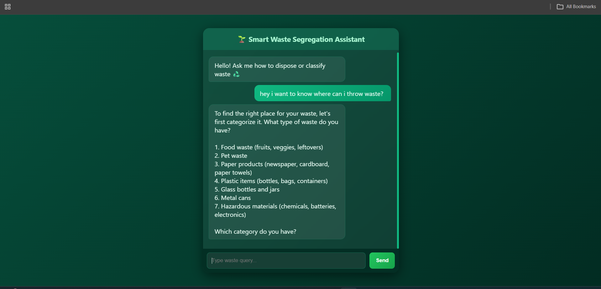

# 🌱 Smart Waste Segregation Assistant

An advanced, locally-hosted AI-based waste management assistant built using Flask and a local LLM (Ollama).  
This system helps users identify, classify, and properly dispose of different types of waste while promoting environmental awareness—keeping all data 100% private on the local machine.

---

You said
---

**Here is a look at the UI in action:**



---


## 🚀 Features

- 🤖 Local AI Inference: Powered by Ollama (llama3.2:1b) for fast and private responses.
- 🧠 Context-Aware Memory: Maintains conversation history within sessions.
- 💬 Interactive Web UI: Clean and responsive frontend built using HTML, CSS, and JavaScript.
- 🌱 Smart Waste Classification: Helps identify and categorize waste into organic, recyclable, hazardous, and more.
- ⚡ REST API Architecture: Clear separation of frontend and backend logic.
- 🔒 Privacy First: No external APIs required—everything runs locally.
- ♻️ Eco Awareness: Educates users on proper disposal and environmental impact.

---

## 🧱 Project Structure

```text
Smart-Waste-Segregation-Assistant/

│
├── backend/
│   ├── app.py                 (Main Flask application)
│   ├── routes/
│   │   └── chatbot.py         (AI routing and logic)
│   ├── database/
│   │   └── db.py              (SQLite database initialization)
│   └── requirements.txt
│
├── static/                    (Optional CSS/JS files)
├── templates/
│   └── index.html             (The responsive Chat UI)
│
├── data/
│   └── waste_data.json     (Contains waste-related data)
│
├── docs/
│   └── README.md
└── .env
```

---

## ⚙️ Installation

1. Clone Project
git clone https://github.com/CertifiedSomebody/Smart-Waste-Segregation-Assistant.git
cd AI-Hospital-Receptionist-System

2. Create Virtual Environment
python -m venv venv

3. Activate Environment
(Windows)
venv\Scripts\activate

(Mac/Linux)
source venv/bin/activate

4. Install Dependencies
pip install -r backend/requirements.txt

---

## 🧠 AI Setup (Ollama - Required for Local Use)

This project uses Meta's hyper-optimized 1B parameter model to run incredibly fast on standard hardware without needing a dedicated GPU.

1. Install Ollama: https://ollama.com/
2. Download and Run the Fast Model: Open a separate terminal and run:
ollama run llama3.2:1b

(Leave this terminal window open in the background while running the Flask app).

---

## 🔑 Environment Variables

Create a .env file in the root directory:

PORT=5000
DEBUG=True
DATABASE_URL=sqlite:///./hospital.db

---

## ▶️ Run the Application

Start the Flask backend server:
python -m backend.app

Once the server is running, open your browser and navigate to: http://127.0.0.1:5000

---

## 🌐 API Endpoints

Base URL: http://127.0.0.1:5000

- Chat Endpoint: POST /api/chatbot/chat
  (Request Example: {"message": "I am feeling a bit under the weather", "session_id": "12345"})
- Get Chat History: GET /api/chatbot/history/<session_id>
- Reset Chat: POST /api/chatbot/reset/<session_id>
- Health Check: GET /health

---

## 🧪 Sample Use Cases

- Identify waste type (plastic, organic, hazardous, etc.)
- Learn correct disposal methods
- Get recycling and composting guidance
- Understand environmental impact
- Ask waste-related questions

⚠️ Important Notes:
- This system does NOT replace official waste disposal guidelines.
- AI responses are for educational and guidance purposes only.
- Always follow local municipal waste rules.

---

## 🔮 Future Enhancements

- 📷 Image-based waste classification (AI vision)
- 📱 Mobile app integration
- 📊 Admin dashboard for analytics
- 🗺️ Geo-based recycling center suggestions
- 🎤 Voice assistant (speech-to-text + text-to-speech)
- 🧠 Persistent memory using database storage

---

## 🧑‍💻 Tech Stack

- Frontend: HTML5, CSS3, Vanilla JavaScript
- Backend: Python, Flask, Flask-CORS
- Database: SQLAlchemy (SQLite)
- AI Engine: Ollama (LLaMA 3.2 1B) / Requests Library

---

### License
This project is for educational and demonstration purposes.

### Author
Prabhatkumar Jha - Built as an AI-powered smart waste segregation assistant for real-world environmental applications.
